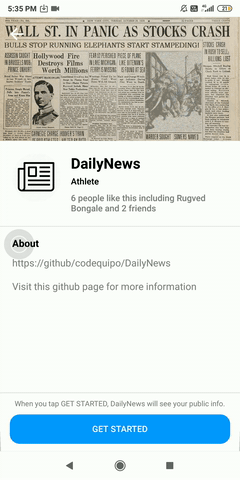

<p align="center">
  <a href="" rel="noopener">
 
</p>
<h1 align = 'center'> TheDailyNews</h1>

<br>

  
&emsp;&ensp; [](https://flask.palletsprojects.com/en/1.1.x/)
[](mongodb.com "MongoDB")
[](https://reactjs.org/docs/getting-started.html)
[](https://nodejs.org/en/)
[](https://www.nltk.org/)
[](https://numpy.org/doc/)
[](https://dialogflow.com/)
[](https://developer.android.com/studio)

</p>
<br>

<h2 align='center'>Motivation</h2>
<p align='center'>
We all live in a very busy world. Someone is getting late to catch a train, someone is getting late for an interview or a meeting, someone is getting late for exams, etc. But in all these chaos we still need to be up-to-date with all the latest developments around the world. The idea of the journalist writing news in shorts is the first thing that we come across but it is not such a good idea.
So it is best to use a machine generated text. Now this machine generated text can’t be sourced from a single article.  Thus our product gives the user fast, reliable and easy access to hundreds of news at just a click. This is the future of the newspapers and tv channels.     
</p>

------------------------------------------

<div align="center">
<h3 align="center"> TheDailyNews Website </h3>
<br>
<p align="center">
  
</p>
<br>
  
<h3 align="center"> TheDailyNews Bot   </a></h3>
<br>
<p>
<h3 align='center'> Check the bot in action over here: <a href="https://www.facebook.com/DailyNews-383636995052537/?ref=bookmarks" target="_top">DailyNews Bot</a>  </h3>
</p>
<p align="center"> 


</p>

<h3 align="center"> TheDailyNews App </a></h3>
<p>
<h3 align='center'> Download the app here: <a href="https://github.com/codequipo/TheDailyNews/raw/master/Android/app-release.apk" target="_top">Download Link </a></h3>
<p align="center">

</p>
</div>


------------------------------------------

### To-do List

- [ ] Improve the existing summarizer. 
- [ ] Try out Deep Learning based models for summarization.
- [ ] Integrate twilio for text based messaging. 
- [x] Create Android App for the same. 

------------------------------------------
###             Note

This project was part of our submission for the subject MIP

------------------------------------------
###             Tech stack
`Backend` : Python ,Flask , NodeJS , Dialogflow <br>
`Database` : MongoDB <br>
`Frontend` : ReactJS , CSS , HTML , Bootstrap  <br>
`Android` : Java <br>

------------------------------------------
### Installing

A step by step series of examples that tell you how to get a development env running

In your cmd:

```
git clone https://github.com/codequipo/TheDailyNews.git
```

Then,

```
cd TheDailyNews/flask_server
pip install -r requirements.txt
python app.py
```

Next

```
cd ../TheDailyNews/Web
npm i
```
Open .env file, enter your credentials for following fields

```
MONGO_USERNAME=ENTER YOUR MONGODB DATABASE USER NAME
MONGO_PASSWORD=ENTER YOUR MONGODB DATABASE USER PASSWORD
MONGO_DB_NAME=ENTER YOUR MONGODB DATABASE NAME
```
Then

```
npm start
cd client
npm i
npm start
```

You are done with the setup now!

------------------------------------------
### Contributing


 We're are open to `enhancements` & `bug-fixes` . Open a PR and we'll look into it. 
 
------------------------------------------
### Contributors

- [@Mayank Chowdhary](https://github.com/m607stars)
- [@Tushar Bapecha](https://github.com/tushargithub44)
- [@Rugved Bongale](https://github.com/rugvedb)
- [@Talha Chafekar](https://github.com/talha1503)

------------------------------------------
<h3 align="center"><b>Developed with :heart: by <a href="https://github.com/m607stars">Mayank</a>, <a href="https://github.com/tushargithub44">Tushar</a> , <a href="https://github.com/rugvedb">Rugved</a> and <a href="https://github.com/talha1503">Talha</a></b></h1>
